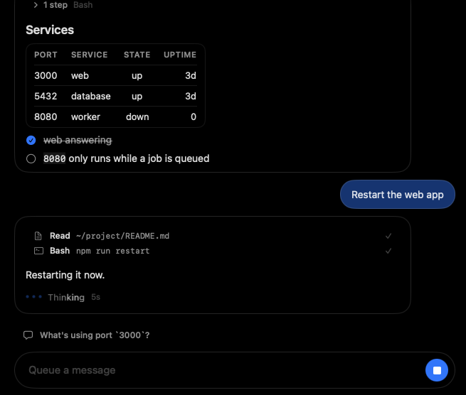

# Glassbar

A chat bar for [Claude Code](https://claude.com/claude-code) on macOS 26. Hold
Option anywhere and an input rises from the bottom of the screen, with the
conversation above it as separate bubbles.

Behind the bar is an ordinary Claude Code session with no terminal attached: the
same tools, `CLAUDE.md`, memory and plan as `claude` in a terminal.



This is an unofficial tool. It is not made by or affiliated with Anthropic, it
is not notarised by Apple, and it comes with no warranty.

## Read this first

**Glassbar runs Claude Code with its permission prompts switched off**
(`--dangerously-skip-permissions`). Claude can run commands and change files in
your home folder without asking you. There is no setting that turns the prompts
back on. If that is not what you want, do not install it.

## What you need

- macOS 26 on Apple silicon
- Claude Code installed and signed in, so that `claude` works in a terminal

## Install

```sh
curl -L -o Glassbar.zip https://github.com/neakoh/glassbar-releases/releases/latest/download/Glassbar-macos-arm64.zip
unzip -o Glassbar.zip
xattr -dr com.apple.quarantine Glassbar.app
rm -rf /Applications/Glassbar.app && mv Glassbar.app /Applications/
open /Applications/Glassbar.app
```

It has a menu-bar icon and no Dock icon. There is no automatic update: run the
same lines again to move to a newer build.

## Keys

| Input | Result |
|---|---|
| Hold Option | Open the bar on the display under the pointer |
| Enter / Shift+Enter | Send / new line. Sent while a reply is being written, a message waits its turn |
| Option+Enter | Send at once: the reply being written is stopped, and this goes out first |
| Option+Left / Option+Right, in an empty input | Step the bar to the left, centre or right of the display |
| Esc | Close the palette, else hide the bar. A reply being written carries on |
| Up in an empty input | Take up the newest queued message to rewrite it |
| ⌘. | Stop a reply |
| ⌘V | Paste text or pictures |
| `/` | Open the command palette; keep typing to narrow it |

## Commands

| Command | Result |
|---|---|
| `/new` | Fresh conversation |
| `/resume` | Lists past conversations; pick one to carry on |
| `/thread` | Moves this conversation into a thread, or out of one |
| `/model` | Lists models; pick one to switch |
| `/iterm` | Continue the conversation in an iTerm tab |
| `/settings` | Open the settings file |

Claude Code's own slash commands join the palette once a session has started.

## Settings

`~/.config/glassbar/glassbar.json` is written on first launch with every key
explained. Saved changes apply straight away.

## What it touches on your Mac

| It reads | Why |
|---|---|
| `~/.claude/projects` | To list your past conversations and show one you pick up |
| `~/.claude/sessions` | To tell which conversations are busy, and which another window has open |
| The screen behind the bar | Only with `look.adaptive` on, which needs Screen Recording. It takes a 12 by 12 patch, averages its brightness and throws it away |

| It writes | What |
|---|---|
| `~/.config/glassbar` | Your settings |
| `~/Library/Application Support/Glassbar` | Open chats, threads and pasted pictures |
| `~/Library/Logs/Glassbar.log` | A short log |
| A conversation's own file | One title line, for a conversation Claude Code left unnamed, and only with threads on |

Glassbar makes no network connection of its own and sends nothing anywhere.
Everything that reaches Anthropic goes through your own Claude Code.

**Threads are off by default.** With `behaviour.threads` on, each new
conversation, and each existing one the first time, is shown to Haiku through
your Claude Code to decide which conversations belong together. That uses your
plan.

## Good to know

- It hides the Dock and blurs what is behind it through macOS calls that Apple
  does not document. A macOS update may break either.
- A conversation that another window has open is shown to read. **Take over**
  closes it there and carries on in the bar.
- A reply that is being written carries on if the bar is quit, and is picked up
  when it is opened again.

## Remove it

```sh
pkill -x Glassbar
rm -rf /Applications/Glassbar.app ~/.config/glassbar ~/Library/Application\ Support/Glassbar ~/Library/Logs/Glassbar.log
```
